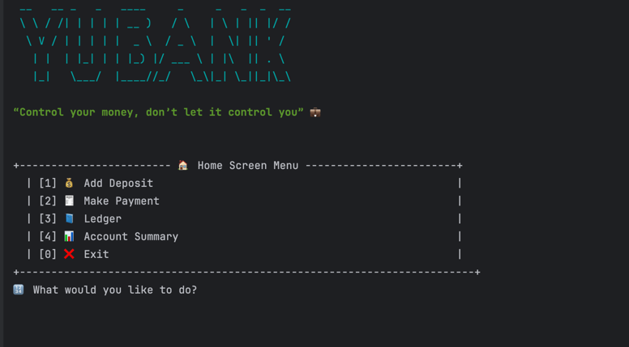
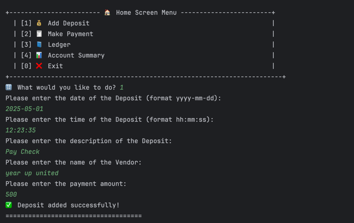
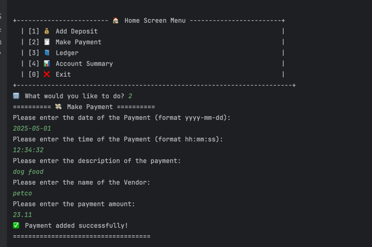
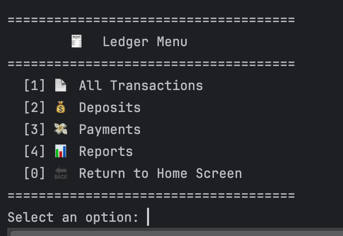
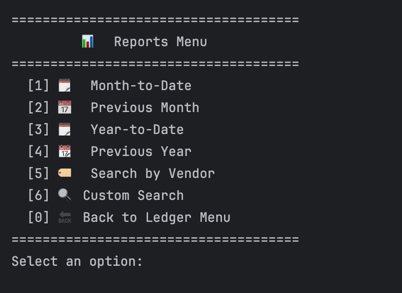
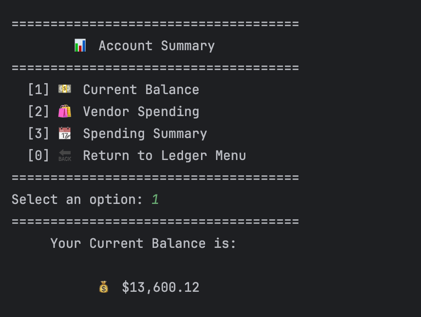

# 🏠 Home Screen Menu

> 

- **[1] 💰 Add Deposit** – Allows the user to add a deposit to the ledger with details like date, time, vendor, and amount.
- **[2] 🧾 Make Payment** – Lets the user record a payment transaction that deducts from the account balance.
- **[3] 📘 Ledger** – Displays all transactions and offers filtering options like deposits, payments, and reports.
- **[4] 📊 Account Summary** – Shows total balance, spending by vendor, and summaries for various time periods.
- **[0] ❌ Exit** – Exits the application.

## 💰 Add Deposit

> 

The **Add Deposit** feature allows users to enter a deposit by providing the date, time, description, vendor, and amount. Once all fields are valid, the deposit is saved to `transactions.csv` and confirmed with a success message.

## 🧾 Make Payment
>
The **Make Payment** feature works similarly to Add Deposit — users enter the date, time, description, vendor, and amount of a payment. The key difference is that the amount is stored as a negative value to represent a deduction from the account. Validated input is saved to `transactions.csv`, and a success message confirms the entry.


## 📘 Ledger Menu

The **Ledger** menu provides users with options to view and filter their financial activity. Users can view all transactions, filter by deposits or payments, or generate reports based on time periods or vendors.



## 📊 Reports Menu

The **Reports** menu gives users powerful insights into their financial activity by filtering transactions over specific time periods or by vendors. It includes options for viewing spending and deposits from the current month, previous month, year-to-date, and previous year. Users can also search transactions by vendor name or perform a custom search using multiple filters.



## 📊 Account Summary

The **Account Summary** menu gives users a snapshot of their financial status. It includes options to view the current balance, analyze spending by vendor, and explore summarized spending trends over various periods. This helps users track where their money is going and make more informed financial decisions.




# ⭐ Additional Features & Enhancements
This section lists the features I implemented beyond the original project instructions to enhance usability, functionality, and user experience:

✅ Completed Challenge Task
I completed the “Challenge Yourself” prompt by adding a Custom Search option in the reports menu, allowing users to filter ledger entries by date range, vendor, description, and approximate amount.

📊 Account Summary Section (Fully Custom Built)
This section includes:

Current Balance – Calculates and displays the current account total.

Vendor Spending – Uses a HashMap to summarize spending per vendor.

Spending Summary – Offers breakdowns for this month, last month, year-to-date, and previous year — including a custom ASCII bar graph comparing income and expenses.

🛡 Robust Input Validation
Wrapped all user input in validation loops with try-catch blocks to ensure the app doesn't crash on invalid entries (e.g., non-numeric input or wrong date format).

🎨 Polished CLI UI
Used ASCII art, color codes, and emojis to enhance the visual appeal of the interface and improve user navigation.

🧠 Practiced Data Structures (HashMap & Set)
First time using a HashMap to manage vendor totals and calculate summarized values.

Implemented a Set to store and display unique vendor names when searching.

📦 Custom Reports with Filters
Enabled users to analyze transactions by month, year, or vendor, and even filter by multiple fields at once using a fully custom-built interface.

📈 Bar Graph Visuals
Designed and aligned ASCII bar graphs to visually compare total income and expenses — scaled proportionally for clarity.

🔁 Reusable Helper Functions
Created helper methods like displayBarSummary() and printTransaction() to reduce code duplication and make the program easier to maintain and expand.

vbnet
Copy
Edit


## 🧠 Interesting Feature: Vendor Spending with HashMap

This code was especially interesting to me because it was my first time using and implementing a `HashMap`. I got to practice how key-value pairs work by storing each vendor's name as the key and their total transaction amount as the value. It took some time to fully understand how this data structure operates, but implementing it in this context helped me build confidence working with collections in Java.

```java
private static void displayVendorSpending() {
    Map<String, Double> vendorTotals = new HashMap<>();

    for (Transaction transaction : transactions) {
        if (vendorTotals.containsKey(transaction.getVendor())) {
            double currentTotal = vendorTotals.get(transaction.getVendor());
            vendorTotals.put(transaction.getVendor(), currentTotal + transaction.getAmount());
        } else {
            vendorTotals.put(transaction.getVendor(), transaction.getAmount());
        }
    }

    for (Map.Entry<String, Double> entry : vendorTotals.entrySet()) {
        System.out.println("Vendor: " + entry.getKey() + " | Total: " + entry.getValue());
    }
        
}


